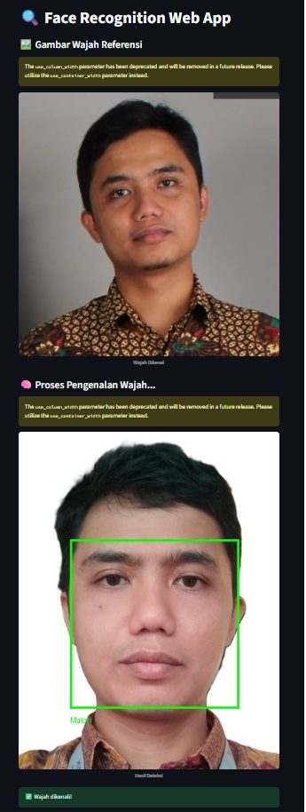
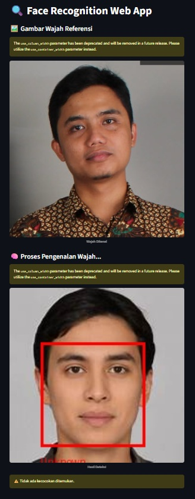

# Aplikasi Web Pengenalan Wajah

Aplikasi web sederhana untuk pengenalan wajah menggunakan **Streamlit** dan library **face_recognition** dalam Python.

## Fitur
- Unggah gambar referensi (wajah dikenal) dan gambar target.
- Deteksi dan tandai wajah secara otomatis pada gambar target.
- Bandingkan wajah untuk menemukan kecocokan dengan gambar referensi.
- Tampilan visual dengan kotak pembatas dan label ("Match" atau "Unknown").
- Antarmuka yang mudah digunakan dengan Streamlit.

## Tampilan Aplikasi

## Teknologi
- Python 3.x
- Streamlit (untuk UI)
- face_recognition (berbasis dlib)
- Pillow (untuk gambar dan anotasi)
- NumPy

## Cara Menjalankan Secara Lokal
1. Clone repositori ini:
   git clone https://github.com/jimbotake/face-recognition.git
   cd face-recognition-app
   
2. Install dependensi:
   pip install -r requirements.txt
   
3. Jalankan aplikasi Streamlit:
   streamlit run app.py

## Cara Penggunaan
- Unggah gambar wajah yang dikenal di sidebar.
- Unggah gambar target di sidebar.
- Aplikasi akan menampilkan wajah yang terdeteksi dan menandai wajah yang cocok.

## Catatan
- Pastikan gambar wajah yang diunggah jelas dan menghadap depan untuk hasil terbaik.
- Level toleransi pencocokan wajah disetel default pada 0.5.
